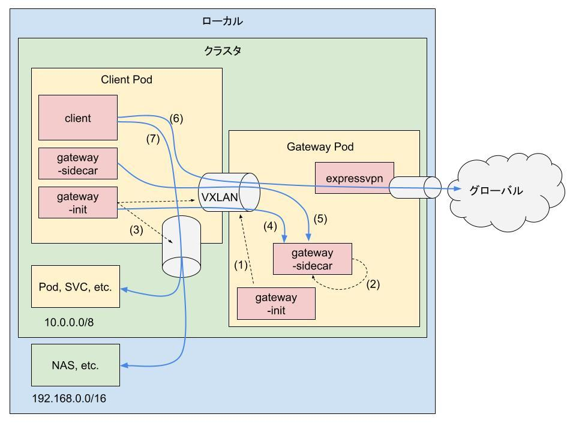
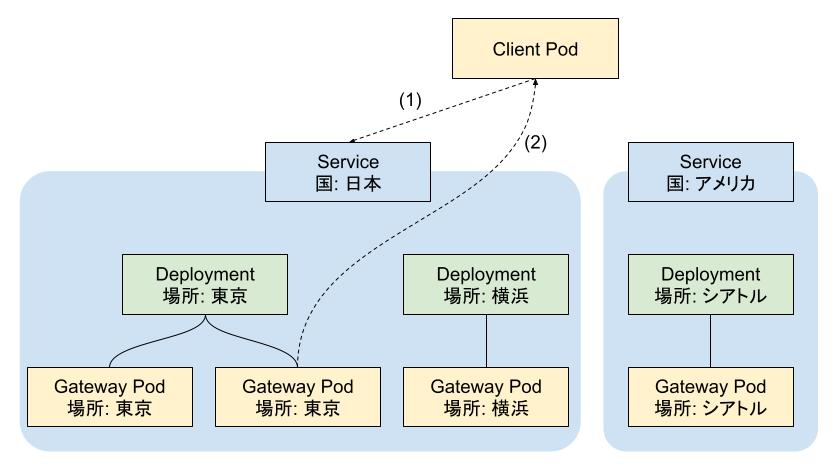

# pod-gateway

A sidecar container to route traffic from a Kubernetes client Pod through a gateway Pod

Kubernetes の Client Pod から別の Gateway Pod を介してトラフィックをルーティングするためのサイドカーコンテナ

Inspired by [toboshii/pod-gateway](https://github.com/toboshii/pod-gateway),
and [angelnu/pod-gateway](https://github.com/angelnu/pod-gateway).

## デフォルトの挙動

1. `vxlan3150` を作成する。
2. Kubernetes 内での IP アドレスを返すサーバーと DNS を起動する。
3. Client Pod のトラフィック制限を行う。
    1. 基本的に全トラフィックを遮断する。
    2. `10.0.0.0/8` と `192.168.0.0/16` を許可する。
    3. Kubernetes 内での Gateway Pod の IP アドレスを取得する。
    4. `vxlan3150` を作成する。
4. `dhclient` を使用して VXLAN 内での IP アドレスを取得・設定する。
5. 定期的に Gateway Pod との疎通を確認し、途切れた場合は 3. に戻る。
6. グローバル行きのトラフィックは Gateway Pod を経由する。
7. ローカル行きのトラフィックは Gateway Pod を経由しない。

## 設定

| 環境変数 | 説明 | デフォルト値 |
| --- | --- | --- |
| PGW_LOG_LEVEL            | `debug`, `info`, `error` から 1 つログレベルを選択します。 | `error` |
| PGW_LOG_TRANSPORTS       | `console`, `file` のいずれかを空白区切りで指定します。 |　`console` |
| PGW_LOG_FILE_PATH        | 上の環境変数に `file` を含めた場合の出力先です。 | |
| PGW_VXLAN_IP_NETWORK     | VXLAN で割り当てられる IP のネットワーク部です。 | `172.29.0` |
| PGW_LOCAL_CIDRS          | Gateway Pod を迂回するための CIDR です。 | `192.168.0.0/16 10.0.0.0/8` |
| PGW_CLIENT_PING_INTERVAL | Client Pod が Gateway Pod との疎通を確認する間隔 (秒) です。 | `10` |

## 使用例

`test/` ディレクトリを参照。
`test/e2e/expressvpn/run.sh` を実行 (注) すると、[kind](https://github.com/kubernetes-sigs/kind) と kubectl がダウンロードされますが、これは `.cache/bin` にダウンロードされるため、グローバル環境が影響を受けることは無いはずです。

(注) 実行には ExpressVPN のアクティベーションコードが必要。

## Gateway Pod の (Kubernetes 内での) IP アドレス

1. `curl -fs http://jp.expressvpn.cluster.local`
2. Gateway Pod の IP アドレスが返ってくる。

Service 経由で Deployment に所属する Pod にアクセスすると、Pod の IP アドレスが提供されます。
Service を使用して ExpressVPN で接続する国をグループ化し、Deployment で都市などの場所を整理することができます。
必ずしもそのような構成にする必要はないですが、以下のようなアプローチでわかりやすく管理できると思います。

- 接続する国の追加や削除は、Service の変更で容易に行える。
- 都市などの場所の追加や削除は、Deployment の変更によって対応可能。
- 冗長性を確保するには、Deployment のレプリカ数を増やすことで対処可能。

## その他

- ExpressVPN でなくても、他の VPN サービスを使用することも可能です。
  ただしその場合は VPN が予期せず切断された場合、トラフィックをブロックする機構が必要になると思います。
  ExpressVPN の場合はカーネルのバージョンがそこまで古くなければこの機構 ([Network Lock](https://www.expressvpn.com/jp/support/troubleshooting/network-lock/)) が使えます。
- 試していないですが、Gateway Pod を特定のノードに配置することで、そのノードを経由する予測可能なソース IP を提供できるかもしれません　(要は Egress Gateway)。
- 1 つの Gateway Pod が持てる Client Pod の数は 236 です。
- ログは JSONL 形式で出力されます。`console` にはそれ以外のログ (Dnsmasq など) も出力されます。
